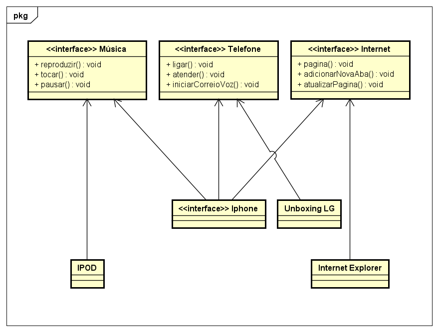

# Projeto iPhone

Este projeto é uma representação simplificada de um iPhone em Java, que contém funcionalidades para reproduzir música, fazer chamadas telefônicas e navegar na internet.

## Estrutura do Projeto

O projeto está organizado em quatro pacotes principais:

1. `musica` - Contém a interface `Musica` e a classe `MusicaPlayer`.
2. `telefone` - Contém a interface `Telefone` e a classe `TelefoneCelular`.
3. `internet` - Contém a interface `Internet` e a classe `NavegadorInternet`.
4. `principal` - Contém a classe `IPhone` e a classe `Main` para execução.

## Diagrama UML

Abaixo está o diagrama UML representando a estrutura do projeto:

## Funcionalidades

### Música

- **Reproduzir**
- **Tocar**
- **Pausar**

### Telefone

- **Ligar**
- **Atender**
- **Iniciar Correio de Voz**

### Internet

- **Abrir Página**
- **Adicionar Nova Aba**
- **Atualizar Página**

## Licença e Restrições

Este projeto é protegido por uma licença e a reutilização e clonagem não são permitidas sem autorização explícita do autor.
